# System Architecture and Usecases

This document provides architectural diagrams and illustrates common usecases for the `esp32-toolkit-lib`.

## 1. Usecases

### 1.1. Use Case 1: Alarm Signal (Remote Device -> Local Device)

This diagram shows the sequence of events when the remote device's PIR sensor detects motion and sends an alarm to the local device, which then forwards it to a connected computer.

```mermaid
sequenceDiagram
    participant Computer
    participant LocalDevice as Local Device
    participant RemoteDevice as Remote Device
    participant PIRSensor as PIR Sensor

    PIRSensor->>+RemoteDevice: Motion Detected
    RemoteDevice->>+LocalDevice: Send Alarm Signal (LoRa)
    LocalDevice->>-RemoteDevice: Acknowledge Signal (LoRa)
    LocalDevice->>+Computer: Forward Alarm (WebSocket)
    Computer-->>-LocalDevice: (Display Alarm)
```



### 1.2. Use Case 2: Test/Ping Signal (Local Device -> Remote Device)

This diagram illustrates the user-initiated test signal from the local device to confirm the remote device is operational.


---

## 2. Detailed Interaction Diagrams

### 2.1. Detailed Alarm Signal Flow

This diagram provides a more detailed view of the internal components and events involved in the alarm signal use case.


### 2.2. Detailed Test/Ping Signal Flow

This diagram details the internal interactions for the user-initiated test signal.


---

## 3. Core System Interactions

These diagrams illustrate the fundamental interactions between core components of the `esp32-toolkit-lib`.

### 3.1. API Module Interaction with LinkInterface

*** TODO ***

### 3.2. Event System

This diagram illustrates the event handling mechanism, where events from sources like `GPIO` or `LOGS` are queued and then processed by registered event handlers.

```mermaid
graph TD
    subgraph "Event Sources"
        GpioInterface[GPIO Interface]
        LogsModule[LOGS Module]
    end

    subgraph "Event Handling"
        EventQueue[Event Queue]
        EventHandler[Registered EventHandler]
    end

    GpioInterface -- "PIN Event" --> EventQueue
    LogsModule -- "LOG Event" --> EventQueue
    EventQueue -- "Dispatched Event" --> EventHandler
